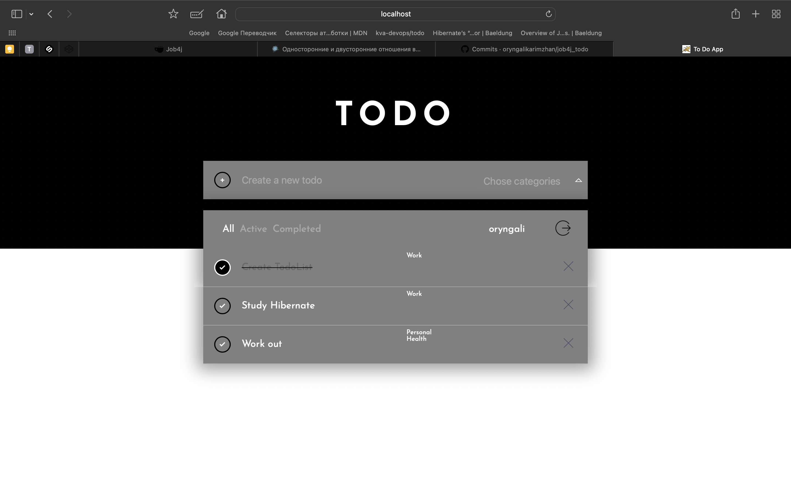

++++++++++++++++++++++++++++TODO App++++++++++++++++++++++++++++++++
+++++++++++++++++++++++++++job4j project++++++++++++++++++++++++++++
++++++++++++++++++++++++Oryngali Karimzhan++++++++++++++++++++++++++

This project is a single page to-do list webapp with the abilities to add, delete tasks, 
change their completeness statuses, and group them by this property. 

Here are main technologies, that i used:
JDK14, Maven, Java Servlet, HTML, CSS, JQuery, Ajax, JavaScript, JSP, JSTL, PostgreSQL, Hibernate

authorization page

registration page

main page

adding task

only completed tasks

only active tasks

